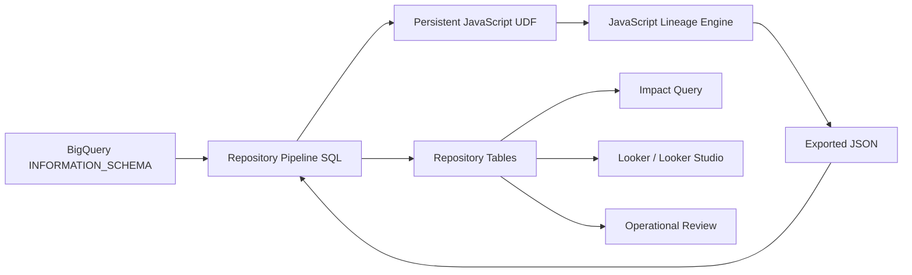
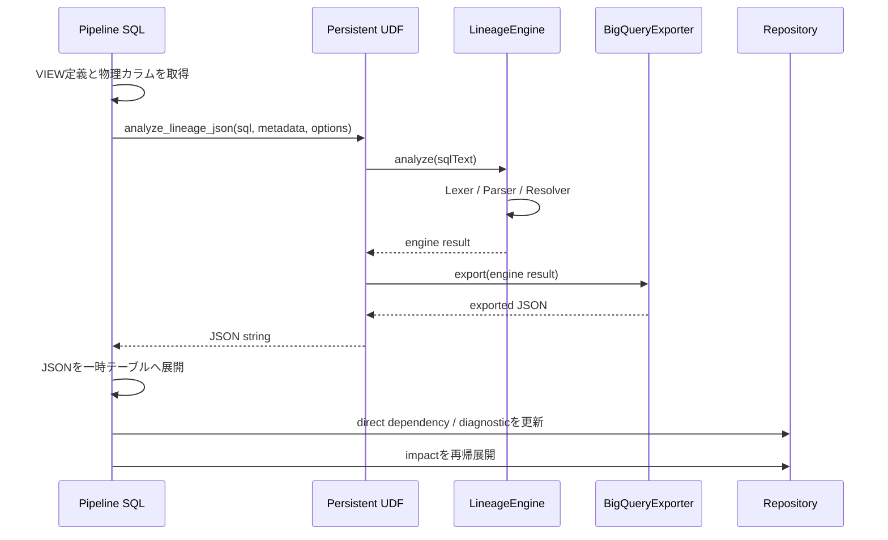

# 1. System Overview

## 1.1 本章の目的

本章では、BigQuery Lineage Engineが何を解決するシステムなのか、どこまでを責任範囲とするのか、入力されたVIEW定義がどのようにRepositoryへ保存されるのかを説明します。

個々のクラスやSQLを読む前に、次の全体像を理解することが重要です。

```text
BigQuery metadata
      ↓
VIEW definition SQL
      ↓
JavaScript analysis engine
      ↓
column-level dependency
      ↓
physical table / physical column
      ↓
Repository
      ↓
impact query / Looker report
```

---

## 1.2 開発背景

BigQueryのデータ基盤では、物理テーブルの上に多数のVIEW、集計VIEW、業務レポート用VIEWが構築されます。

物理テーブルのカラムに対して次のような変更を行う場合、下流への影響確認が必要です。

- カラム削除
- カラム名変更
- データ型変更
- NULL可否変更
- 値の意味やコード体系の変更
- STRUCTやARRAYのフィールド変更
- VIEW定義の変更

オブジェクト単位の依存関係だけでは、次の問いに答えられません。

> `customers.customer_id`を変更した場合、どのVIEWのどの出力カラムに影響するか。

本システムでは、SQLを字句・構文・名前解決の段階に分けて解析し、列単位の物理依存関係をRepositoryへ保存します。

---

## 1.3 目的

主要目的は次の3点です。

### 1.3.1 物理カラムまでの依存解決

VIEWの出力カラムを、最終的な物理テーブルと物理カラムまで追跡します。

```text
v_customer_sales.customer_id
    ↓
v_customer_profile.customer_id
    ↓
customers.customer_id
```

### 1.3.2 変更影響の下流展開

Root物理カラムを起点として、影響を受けるVIEWとカラムをRank付きで抽出します。

```text
Rank 1: customers.customer_id
        → v_customer_profile.customer_id

Rank 2: customers.customer_id
        → v_customer_profile.customer_id
        → v_customer_sales.customer_id
```

### 1.3.3 判断材料の提供

単に依存先を列挙するのではなく、次の情報を利用者に提供します。

- 影響先VIEW
- 影響先カラム
- 直接・間接のRank
- 依存経路
- 解決状態
- 診断情報
- 将来的には利用用途や影響種別

---

## 1.4 非目的

現行版は次の機能を主目的としていません。

- SQL実行結果の値レベル追跡
- クエリ性能分析
- BigQuery権限管理
- LookerモデルやExploreの完全な意味解析
- SQLの自動修正
- SQLフォーマッター
- 汎用的な全SQL方言対応

対象はBigQuery Standard SQLであり、列レベルの構造的依存関係を解析することに集中します。

---

## 1.5 システム境界



### システム内部

- VIEW定義の取得
- SQLのToken化
- Query AST生成
- Source・Column・Output Column解決
- 物理カラム解決
- Lineage生成
- Diagnostic生成
- BigQuery向けJSON出力
- Repository保存
- Rank付きImpact展開

### システム外部

- 変更申請の承認
- チームへの影響確認依頼
- 利用者による最終判断
- GCSへの手動配置
- 本番反映の承認

---

## 1.6 主要コンポーネント

| 層 | コンポーネント | 主な責務 |
|---|---|---|
| Metadata | INFORMATION_SCHEMA | VIEW定義、物理カラム、ジョブ情報の提供 |
| Pipeline | BigQuery SQL | 対象抽出、UDF呼び出し、Repository更新 |
| UDF | Persistent JavaScript UDF | JavaScript bundleの実行入口 |
| Lexer | `lexer.js` | SQL文字列をToken配列へ変換 |
| Parser | `parser/*.js` | Query・Clause・Expressionの構造化 |
| AST | `ast_factory.js` | Expression AST生成と検証 |
| Resolver | `resolver/*.js` | Source、Column、Output、Physical、Lineage、Impact解決 |
| Diagnostics | `diagnostic_engine.js` | 警告・エラーの構造化 |
| Exporter | `bigquery_exporter.js` | BigQuery保存向け行配列へ変換 |
| Repository | `lineage_*` tables | 解析結果と影響結果の永続化 |
| Reporting | Looker SQL | 変更影響の検索と配布 |

---

## 1.7 エンドツーエンド処理



### Step 1: 解析対象取得

Repository Pipeline SQLが対象VIEWを決定します。

対象選択には次が関係します。

- `lineage_definition_registry`
- VIEW定義のハッシュ
- 前回解析状態
- 新規・変更・再解析フラグ
- Scheduled Query / CTASの登録情報

### Step 2: 物理カラムメタデータ取得

`INFORMATION_SCHEMA.COLUMNS`および`COLUMN_FIELD_PATHS`相当の情報を、JavaScriptへ渡せる配列へ変換します。

目的は次のとおりです。

- `SELECT *`の展開
- `alias.*`の展開
- STRUCTフィールド解決
- 参照先テーブルにカラムが存在するかの判定

### Step 3: JavaScript解析

`LineageEngine.analyze()`が、定められた順序でParserとResolverを実行します。

```text
LEXER
QUERY_PARSER
SOURCE_RESOLVER
COLUMN_RESOLVER
OUTPUT_COLUMN_RESOLVER
PHYSICAL_COLUMN_RESOLVER
LINEAGE_RESOLVER
IMPACT_RESOLVER（任意）
```

### Step 4: BigQuery向け出力

JavaScript内部のオブジェクトは、そのままではSQLから扱いにくいため、`BigQueryExporter`がテーブルごとの行配列へ変換します。

### Step 5: Repository更新

Pipeline SQLはJSON配列を`JSON_QUERY_ARRAY`などで展開し、Repositoryの通常列へ保存します。

### Step 6: Impact再構築

`lineage_direct_dependency`を再帰的にたどり、`lineage_impact`を作成します。

---

## 1.8 代表的な入力と出力

### 入力SQL

```sql
SELECT
  customer_id,
  MAX(order_amount) AS maximum_order_amount
FROM `audeodb.sample_ds.orders`
GROUP BY customer_id
```

### 概念的な出力

```text
output: customer_id
  depends on:
    audeodb.sample_ds.orders.customer_id

output: maximum_order_amount
  depends on:
    audeodb.sample_ds.orders.order_amount
    audeodb.sample_ds.orders.customer_id
```

後者では`customer_id`が集約単位に利用されるため、値そのものをコピーしていなくても結果へ影響し得ます。現行Repositoryのusage情報は今後さらに精密化する予定です。

---

## 1.9 設計原則

### 責務分離

Lexer、Parser、Resolver、Exporter、SQL Pipelineを分離します。

### 段階的解決

一度に物理カラムまで解決せず、次の順序で情報を確定します。

```text
構文
→ Source
→ Column reference
→ Output column
→ Physical column
→ Lineage
→ Impact
```

### 中間結果の保持

各段階の結果を`ResolutionContext`へ登録します。後続Resolverは、前段の結果を読み取ります。

### 解決不能を隠さない

解決不能な参照は捨てず、`UNRESOLVED`、`AMBIGUOUS`、Diagnosticとして保持します。

### strict / non-strict

- strict: ERROR診断または工程例外で停止
- non-strict: 可能な範囲の結果とDiagnosticを返す

運用バッチでは、1つのVIEWの問題で全体停止しない構成が必要なため、non-strictが重要です。

---

## 1.10 現行バージョンの制約

- `dependency_usage_type`は現行投入処理では主に`SELECT`となる
- 動的SQLの完全解析は対象外
- UDFや外部処理の内部ロジックは、SQL式として見える範囲のみ解析
- 権限により取得できないメタデータは解決不能になる
- 非常に深い再帰経路は`max_impact_rank`で制限
- SQL方言はBigQuery Standard SQLを前提とする

---

## 1.11 チーム内での役割分担例

| 担当 | 主に確認する領域 |
|---|---|
| SQL開発者 | Parser対応範囲、出力Lineage |
| JavaScript開発者 | Lexer、Parser、Resolver、テスト |
| データ基盤担当 | Pipeline SQL、Repository、権限 |
| レポート担当 | lineage_impact、Looker SQL |
| 運用担当 | Diagnostic、再解析、手動デプロイ |
| 利用チーム | 最終的な業務影響判断 |

---

## 1.12 本章のまとめ

BigQuery Lineage Engineは、VIEW定義を文字列検索する仕組みではありません。SQLを構造化して解釈し、段階的に名前解決を行う小規模なコンパイラ型エンジンです。

後続章では、解析結果の保存先であるRepositoryと、解析を実行するJavaScriptエンジンを詳しく説明します。
