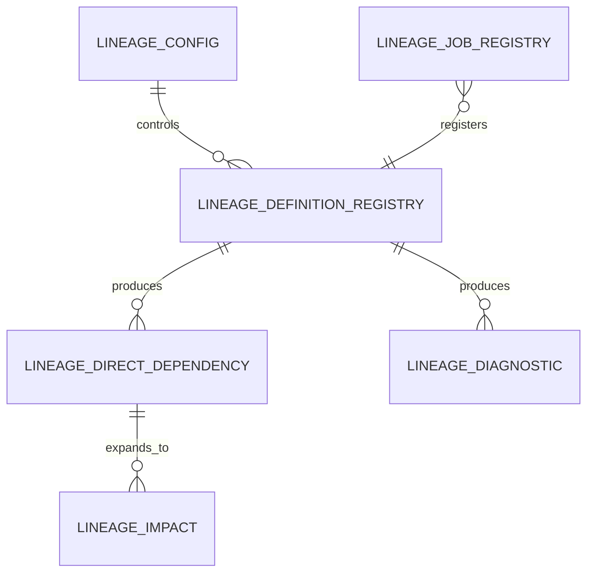
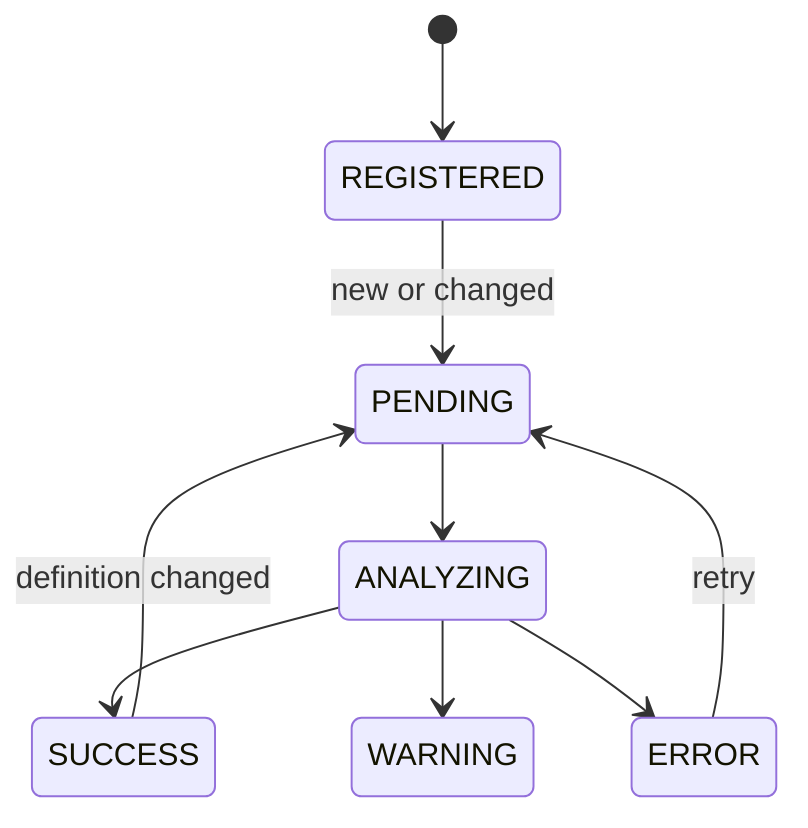

# 2. Repository Design

## 2.1 本章の目的

Repositoryは、JavaScriptエンジンが生成した解析結果を永続化し、日常の影響検索を高速かつ安定して行うためのデータ層です。

本章では、運用Repositoryを中心に説明します。JavaScript詳細デバッグ用の`lineage_tokens`や`lineage_query_scopes`等のテーブル群と、運用Pipelineの4つの主要テーブルは用途が異なるため、区別して理解する必要があります。

---

## 2.2 Repositoryを設ける理由

解析のたびに全VIEWをJavaScriptで再解析すると、次の問題が発生します。

- レポート表示のたびに解析コストが発生する
- 同じVIEWを何度も解析する
- 過去の解析状態を追跡しにくい
- 解析エラーと前回成功結果の扱いが難しい
- Rank付きの下流展開を都度行う必要がある

そこで、解析処理と参照処理を分離します。

```text
解析時
VIEW SQL → JavaScript → Repository

参照時
Repository → Impact Query → Looker
```

---

## 2.3 Repository構成

運用上の主要テーブルは次のとおりです。



| テーブル | 主な役割 |
|---|---|
| `lineage_config` | 環境・UDF・対象Dataset・実行条件 |
| `lineage_execution_account_config` | Scheduled Query等の実行アカウント |
| `lineage_definition_registry` | 解析対象定義と解析状態 |
| `lineage_direct_dependency` | 1段の直接依存 |
| `lineage_impact` | Rootから下流へのRank付き依存 |
| `lineage_diagnostic` | エラー・警告・調査情報 |
| `lineage_job_registry` | Scheduled Query / CTAS等の登録 |
| `lineage_pipeline_run`等 | Pipelineの実行記録 |

---

## 2.4 lineage_config

### 目的

環境依存値をSQL本文へ散在させず、一つの型付き設定行として管理します。

主な設定値:

- Repository project / dataset
- UDF project / dataset / function
- GCS library URI
- 対象project / region / datasets
- 初回・差分ジョブ探索日数
- strict mode
- compact export
- 最大Impact Rank

### 設計上の意図

設定値を一行のSTRUCTとして読み込むことで、後続SQLで型を保ったまま参照できます。

```sql
SELECT AS STRUCT
  repository_project_id,
  repository_dataset,
  udf_function_name,
  max_impact_rank
FROM `...lineage_config`
WHERE config_id = 'default'
```

---

## 2.5 lineage_definition_registry

### 目的

解析対象となるVIEW、Scheduled Query、CTAS等の定義を管理します。

概念的な情報:

- オブジェクトパス
- オブジェクト種別
- SQL定義
- 定義ハッシュ
- 解析対象フラグ
- 前回解析日時
- 前回解析状態
- 再解析要否
- 取得元情報

### 状態管理



### 重要性

Pipelineはこのテーブルを基準に、変更された定義だけを解析できます。全件再解析を避けるための中心テーブルです。

---

## 2.6 lineage_direct_dependency

### 目的

1つの解析対象オブジェクトについて、出力カラムから直前の依存元へのエッジを保存します。

概念例:

```text
v_customer_profile.customer_id
    → customers.customer_id
```

またはVIEW間:

```text
v_customer_sales.customer_id
    → v_customer_profile.customer_id
```

### 代表的な列

- origin側またはsource側のproject/dataset/object/column
- impacted側またはtarget側のproject/dataset/object/column
- object type
- usage type
- resolution status
- expression
- generation type
- lineage path情報
- 解析識別情報

実際の列名はSQL DDLを正とし、設計書では役割を中心に説明します。

### 一行一エッジ

`lineage_direct_dependency`は、下流全体ではなく、一段の関係を表します。

```text
A → B → C
```

の場合:

```text
A → B
B → C
```

の2行を保持します。

この形式により、再帰SQLで任意のRankまで展開できます。

---

## 2.7 lineage_impact

### 目的

Root物理カラムを起点として、すべての下流VIEW・カラムを検索しやすい形で保持します。

### 代表的な結果

| root | impacted | rank |
|---|---|---:|
| customers.customer_id | v_customer_profile.customer_id | 1 |
| customers.customer_id | v_customer_sales.customer_id | 2 |
| customers.customer_id | v_customer_sales_ranked.customer_id | 3 |

### dependency_path

経路は配列またはJSON相当の値で保持されます。

```text
[
  audeodb.sample_ds.customers.customer_id,
  audeodb.sample_ds.v_customer_profile.customer_id,
  audeodb.sample_ds.v_customer_sales.customer_id
]
```

レポートでは表示用に次へ変換します。

```text
customers.customer_id
→ v_customer_profile.customer_id
→ v_customer_sales.customer_id
```

### Rankの定義

- Rank 1: Rootから直接参照されるVIEWカラム
- Rank 2: Rank 1のVIEWを介して参照されるVIEWカラム
- Rank N: N段の依存経路

### 再帰展開

概念的には次の処理です。

```sql
WITH RECURSIVE impact AS (
  -- Rank 1
  SELECT ...
  FROM lineage_direct_dependency

  UNION ALL

  -- Rank N + 1
  SELECT ...
  FROM impact
  JOIN lineage_direct_dependency
    ON impact.current_object = edge.origin_object
)
SELECT * FROM impact;
```

実際には循環防止、重複排除、最大Rank、経路保持が追加されます。

---

## 2.8 lineage_diagnostic

### 目的

解析不能や曖昧な参照を、運用者が調査可能な形で保存します。

主な情報:

- severity
- diagnostic code
- message
- parser / resolver stage
- scope type
- token位置
- SQL context
- reference name
- candidate source
- resolved source
- diagnostic JSON

### 前回成功結果の保護

実運用では、VIEWの最新解析が失敗した場合に、直ちに過去の正常な依存関係を削除すると影響検索が空になります。

そのためPipelineは、次を区別します。

- 最新解析のDiagnostic
- 前回成功時のDependency
- 新しいDependencyへの置換可否

この扱いはPipeline SQLの重要な設計点です。

---

## 2.9 lineage_job_registry

### 目的

VIEW以外に、Scheduled Queryが生成するテーブルやCTASを依存関係へ含めるための登録情報を保持します。

Scheduled Queryの抽出では、運用方針として次の実行アカウントを対象とします。

```text
audeodb@appspot.gserviceaccount.com
```

ジョブ履歴から次を取得・推定します。

- 実行SQL
- destination table
- 実行アカウント
- 実行日時
- ジョブ種別
- 定義ハッシュ

---

## 2.10 詳細解析テーブル群

パッケージには、JavaScript出力を詳細に保存するためのDDLも含まれます。

例:

- `lineage_analyses`
- `lineage_tokens`
- `lineage_query_scopes`
- `lineage_sources`
- `lineage_cte_definitions`
- `lineage_column_references`
- `lineage_output_columns`
- `lineage_physical_column_references`
- `lineage_wildcard_expansions`

これらは主に次の用途です。

- Parserデバッグ
- AST・Scope調査
- 新機能開発
- Golden testとの差分確認
- Resolverの中間結果検証

一方、通常の影響レポートは運用Repositoryの`lineage_impact`を参照します。

### 二層構成

```text
Detailed analysis tables
  詳細・デバッグ・開発向け

Operational repository tables
  日次運用・Impact検索・Looker向け
```

---

## 2.11 PartitionとCluster

解析履歴系テーブルでは、一般に`analyzed_at`の日付でPartitionし、次のキーでClusterします。

- analysis_id
- view_project
- view_dataset
- view_name
- scope_id
- column_name

目的:

- 特定解析IDの調査
- 特定VIEWの最新履歴取得
- 特定カラムの検索
- 保存コストと走査量の抑制

運用Repositoryでは検索パターンに応じて、Root project/dataset/object/column、またはimpacted側のパスをCluster候補とします。

---

## 2.12 更新方式

### Registry

`MERGE`で新規・変更・既存を統合します。

### Direct Dependency

解析成功時に対象オブジェクト分を置換します。解析失敗時の前回正常結果保持に注意します。

### Diagnostic

最新診断を登録し、調査可能なJSONも保持します。

### Impact

Direct Dependency全体から再構築します。現行版は`CREATE OR REPLACE TABLE`方式を採用しています。

---

## 2.13 参照SQL

Rootテーブル・カラムから影響先を取得する基本形:

```sql
SELECT
  CONCAT(
    origin_project,
    '.',
    origin_dataset,
    '.',
    origin_object
  ) AS root_table_path,
  origin_column AS root_column_name,
  CONCAT(
    impacted_project,
    '.',
    impacted_dataset,
    '.',
    impacted_object
  ) AS impacted_view_path,
  impacted_column AS impacted_column_name,
  impact_rank,
  dependency_path,
  generation_type,
  resolution_status,
  is_cycle
FROM `audeodb.lineage_repository.lineage_impact`
WHERE
  origin_project = 'audeodb'
  AND origin_dataset = 'sample_ds'
  AND origin_object = 'customers'
  AND origin_column = 'customer_id'
  AND impacted_object_type = 'VIEW'
ORDER BY
  impact_rank,
  impacted_view_path,
  impacted_column_name;
```

---

## 2.14 データ品質ルール

Repositoryへ保存する際は、少なくとも次を検証します。

- RootとImpactedの必須キーがNULLでない
- Rankが1以上
- dependency_pathの先頭がRootと一致
- dependency_pathの末尾がImpactedと一致
- `is_cycle = false`の通常行で経路重複がない
- `RESOLVED`行には解決済みのsourceがある
- 同一エッジの重複がない

---

## 2.15 循環依存

VIEW間に循環がある場合、再帰SQLが無限に継続しないよう経路内の既出ノードを確認します。

```text
A → B → C → A
```

検出時:

- `is_cycle = true`
- それ以上の展開を停止
- DiagnosticまたはImpact結果として保持

---

## 2.16 保持期間

推奨方針:

- Registry: 現行状態を継続保持
- Direct Dependency: 現行正常状態を保持
- Impact: 現行状態を保持
- Diagnostic: 一定期間の履歴を保持
- Pipeline run log: 監査要件に応じて保持
- Detailed analysis tables: 開発・調査要件に応じてPartition expirationを検討

---

## 2.17 権限

最低限の役割分離:

| 操作 | 権限 |
|---|---|
| Metadata取得 | 対象projectのINFORMATION_SCHEMA参照 |
| UDF実行 | Routine利用、GCSライブラリ読取 |
| Repository更新 | Dataset Data Editor相当 |
| Looker参照 | Repository Data Viewer |
| 設定変更 | 限定された管理者 |

---

## 2.18 Repository運用上の注意

- `lineage_impact`は解析原本ではなく、検索用の展開結果
- 不具合調査は`lineage_direct_dependency`と`lineage_diagnostic`へ戻る
- 物理カラムメタデータ取得失敗はWildcard展開へ影響する
- 最新解析失敗時に正常結果を消さない
- `max_impact_rank`を無制限にしない
- 定義ハッシュ変更時のみ再解析することでコストを抑える

---

## 2.19 本章のまとめ

Repositoryは単なるログ保存先ではありません。

- 解析対象管理
- 正常結果の保持
- 直接依存の原本
- Rank付き影響展開
- 診断情報
- レポート提供

を担う、Lineage Engineの運用基盤です。
