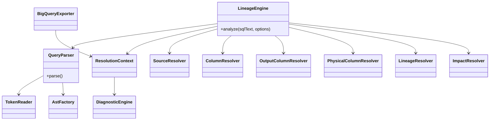
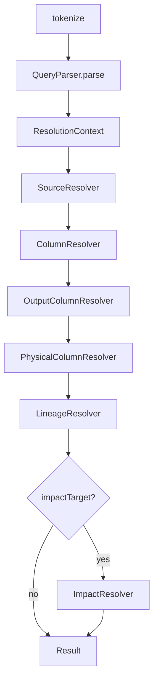

# 3. JavaScript Engine

## 3.1 本章の目的

本章は、JavaScriptに不慣れなメンバーが、SQL文字列がどのように物理カラムLineageへ変換されるかをコードレベルで追えるようにすることを目的とします。

実装基準は`lineage v1.5.0-023`です。

---

## 3.2 なぜJavaScriptを使うのか

BigQueryのJavaScript UDFでは、文字列処理、配列、オブジェクト、クラスを利用できます。

SQLだけでParserを実装する場合、次の処理が複雑になります。

- 1文字ずつ読み進める
- コメントや文字列リテラルを区別する
- 括弧の対応を取る
- 再帰的な式を解析する
- ASTを作る
- Scopeごとに名前解決する

JavaScriptでは、これらをクラスと配列で表現しやすくなります。

ただし、本システムはWebアプリではありません。JavaScriptは**SQL解析エンジンの実装言語**として使用します。

---

## 3.3 ソース構成

```text
javascript/src/
├── ast/
│   └── ast_factory.js
├── diagnostics/
│   └── diagnostic_engine.js
├── engine/
│   └── lineage_engine.js
├── exporter/
│   └── bigquery_exporter.js
├── lexer/
│   └── lexer.js
├── parser/
│   ├── query_parser.js
│   ├── clause_parser.js
│   ├── select_parser.js
│   ├── from_parser.js
│   ├── where_parser.js
│   ├── group_by_parser.js
│   ├── having_parser.js
│   ├── qualify_parser.js
│   ├── order_by_parser.js
│   ├── limit_parser.js
│   └── expression_parser.js
├── resolver/
│   ├── resolution_context.js
│   ├── source_resolver.js
│   ├── column_resolver.js
│   ├── output_column_resolver.js
│   ├── physical_column_resolver.js
│   ├── lineage_resolver.js
│   └── impact_resolver.js
└── token/
    └── token_reader.js
```

---

## 3.4 全体クラス図



---

## 3.5 公開入口: LineageEngine

`LineageEngine`は各処理を正しい順序で呼ぶオーケストレーターです。

SQL文法そのものは実装しません。

### Constructor

```javascript
const engine = new LineageEngine({
  physicalColumns,
  strictMode: false
});
```

- `physicalColumns`: INFORMATION_SCHEMAから取得した物理カラム配列
- `strictMode`: ERROR時に例外停止するか

### analyze

```javascript
const result = engine.analyze(sqlText, {
  impactTarget: null
});
```

### 実行順



コード上では`failedStage`を更新しながら各工程を実行します。例外が発生した場合、どの工程で失敗したかを保持できます。

---

## 3.6 JavaScriptの基本表現

### 配列

```javascript
const tokens = [];
tokens.push(token);
```

SQLのToken、Source、Column Referenceなどは配列で保持します。

### オブジェクト

```javascript
const token = {
  token_seq: 1,
  token: "SELECT",
  normalized_token: "SELECT",
  token_type: "KEYWORD"
};
```

JavaScriptのオブジェクトは、SQLのSTRUCTやJSONに近い構造です。

### Map

```javascript
const sourceById = new Map();
sourceById.set(source.source_id, source);
```

IDから要素を高速に取得する索引として使用します。

### Set

```javascript
const visited = new Set();
```

既に処理したScopeや経路を記録し、循環や重複を防ぎます。

### nullish coalescing

```javascript
const physicalColumns = options.physicalColumns ?? [];
```

左辺が`null`または`undefined`の場合だけ右辺を利用します。

---

## 3.7 Lexer

### 責務

`lexer.js`の`tokenize(sqlText)`は、SQL文字列をToken配列へ変換します。

```text
SQL text
   ↓
characters
   ↓
Token[]
```

### Token例

入力:

```sql
SELECT customer_id FROM customers
```

出力概念:

```json
[
  {
    "token_seq": 1,
    "token": "SELECT",
    "normalized_token": "SELECT",
    "token_type": "KEYWORD",
    "line_no": 1,
    "column_no": 1,
    "paren_depth": 0
  },
  {
    "token_seq": 2,
    "token": "customer_id",
    "normalized_token": "CUSTOMER_ID",
    "token_type": "IDENTIFIER",
    "line_no": 1,
    "column_no": 8,
    "paren_depth": 0
  }
]
```

### なぜToken化するのか

文字列検索だけでは、次を区別できません。

```sql
SELECT 'FROM customers' AS text
-- FROM dummy
FROM real_table
```

Lexerは文字列リテラル、コメント、予約語、識別子を区別します。

### 主な認識対象

- Keyword
- Identifier
- Backtick identifier
- String literal
- Numeric literal
- Operator
- Symbol
- Comment
- Parenthesis
- Bracket

### 括弧深度

```sql
SELECT
  IF(a = 1, SUM(b), 0)
```

括弧内のTokenには深度が付きます。Clause境界やトップレベルカンマの判定に利用します。

重要なルール:

- `(`自体をpushした後に深度を増やす
- `)`の前に深度を減らしてからpushする
- 括弧内部のTokenのみ深度が1以上になる

### 行・列番号

Diagnosticでエラー位置を示すため、Tokenは`line_no`と`column_no`を保持します。

---

## 3.8 TokenReader

ParserがToken配列のindexを直接操作すると、境界処理やコメント除外が各所に重複します。

`TokenReader`はToken配列を安全に読むための共通部品です。

### 主要メソッド

| メソッド | 用途 |
|---|---|
| `current()` | 現在Token |
| `peek(offset)` | 前後Tokenを見る |
| `consume()` | 現在Tokenを返して次へ |
| `advance(count)` | 前へ進む |
| `rewind(count)` | 戻る |
| `mark()` | 現在位置を記録 |
| `restore(mark)` | 記録位置へ戻る |
| `moveToTokenSeq()` | token_seqで移動 |
| `matches()` | Token値を比較 |
| `skipComments()` | コメントを飛ばす |
| `peekNonComment()` | コメント以外を先読み |
| `findMatchingCloseParenthesis()` | 対応する閉じ括弧 |
| `sliceByTokenSeq()` | token_seq範囲を取得 |
| `findForward()` | 条件付き前方検索 |
| `clone()` | 同一配列上のReader複製 |

### token_seqを外部基準にする理由

配列indexは、フィルタやsliceで変化します。`token_seq`はLexerが付与した安定IDなので、Parser間・Diagnostic・Repositoryで共通に利用できます。

---

## 3.9 QueryParser

### 責務

SQL全体をQuery ASTへ変換します。

担当例:

- WITH句
- SELECT
- FROM
- WHERE
- GROUP BY
- HAVING
- QUALIFY
- ORDER BY
- LIMIT
- UNION / INTERSECT / EXCEPT
- CTE
- Query Scope

### 出力概念

```json
{
  "node_type": "QUERY",
  "common_table_expressions": [],
  "select": [],
  "from": {},
  "where": {},
  "group_by": {},
  "having": {},
  "qualify": {},
  "order_by": {},
  "limit": {},
  "set_operations": []
}
```

### QueryとClauseの分離

`QueryParser`はSQL全体の骨格を管理し、各句の詳細は専用Parserへ委譲します。

---

## 3.10 ClauseParser

`ClauseParser`はQuery内の句境界を検出します。

```text
SELECT ... FROM ... WHERE ... GROUP BY ...
```

括弧深度0のKeywordだけを句境界として扱うことが重要です。

次の`FROM`は外側Queryの句境界ではありません。

```sql
SELECT
  (SELECT MAX(x) FROM inner_table) AS max_x
FROM outer_table
```

### 専用Parser

| Class | 対象 |
|---|---|
| SelectParser | SELECT項目、alias、wildcard |
| FromParser | FROM source、JOIN、UNNEST、subquery |
| WhereParser | WHERE式 |
| GroupByParser | GROUP BY項目 |
| HavingParser | HAVING式 |
| QualifyParser | QUALIFY式 |
| OrderByParser | ORDER BY項目 |
| LimitParser | LIMIT / OFFSET |

---

## 3.11 SelectParser

### 責務

- SELECT修飾子の除去
- トップレベルカンマ分割
- 出力alias判定
- `*` / `alias.*`
- `EXCEPT`
- `REPLACE`
- Expression AST生成
- Token範囲保持

### SELECT AS VALUE / STRUCT

SELECT直後の修飾子を通常の出力式と混同しないよう除去します。

```sql
SELECT AS STRUCT
  customer_id,
  name
```

### コメント除去

現行方針では、`removeCommentTokens()`相当の処理をSelectParser内に保持します。

他のClause Parserで同様の処理が複数必要になった段階で、共通化を再検討します。

---

## 3.12 FromParser

### 責務

- 物理テーブル参照
- CTE参照
- Subquery
- JOIN
- UNNEST
- alias
- source_role
- join_seq
- source token range

### Source概念

```json
{
  "source_type": "PHYSICAL_TABLE",
  "source_name": "audeodb.sample_ds.customers",
  "source_alias": "c"
}
```

この段階では「同名のCTEか物理テーブルか」などの最終解決をSourceResolverへ委譲する場合があります。

---

## 3.13 ExpressionParser

### 責務

式の構造を解析し、AstFactoryを呼び出してExpression ASTを生成します。

対応例:

- Identifier
- Literal
- Binary / Unary operator
- Function call
- CASE
- CAST等の関数形
- BETWEEN
- IN
- IS NULL
- DISTINCT FROM
- Parenthesized expression
- Scalar subquery
- EXISTS
- Window expression

### ParserとAstFactoryの分離

以前はParserがASTオブジェクトを直接生成すると、Node構造とvalidationがParserへ散在します。

現在は:

```text
ExpressionParser
  構文を判断する

AstFactory
  正しいNodeを生成する
```

と分離しています。

---

## 3.14 AstFactory

### 主な生成メソッド

- `createBinary`
- `createUnary`
- `createBetween`
- `createIn`
- `createIs`
- `createDistinctFrom`
- `createIdentifier`
- `createWildcard`
- `createLiteral`
- `createFunctionCall`
- `createParenthesized`
- `createExpressionList`
- `createSubquery`
- `createCaseWhen`
- `createCase`
- `createExists`
- `createWindowExpression`
- `createWindowSpecification`
- `createWindowOrderItem`

### 例

入力式:

```sql
amount * quantity
```

概念AST:

```text
BINARY_EXPRESSION(*)
├── IDENTIFIER(amount)
└── IDENTIFIER(quantity)
```

### Validation

AstFactoryは、必要なNodeやToken範囲が欠けていないかを生成時に確認します。

---

## 3.15 ResolutionContext

Parserと複数のResolverの結果を一つの解析単位として保持します。

### 保持項目

```text
tokens
query_ast
source_resolution
column_resolution
output_column_resolution
physical_column_resolution
lineage_resolution
impact_resolution
diagnostics
```

### 導入理由

Contextがない場合、後続Resolverの引数が増え続けます。

```javascript
resolve(
  tokens,
  queryAst,
  sourceResolution,
  columnResolution,
  outputResolution,
  diagnostics
)
```

Contextに集約すると:

```javascript
resolve(context)
```

となり、段階追加が容易です。

### setter validation

各`set...Resolution()`は、`node_type`を確認して不正な結果登録を防ぎます。

---

## 3.16 SourceResolver

### 責務

QueryごとにScopeを作り、FROM Sourceを解決します。

解決対象:

- Physical table
- CTE
- Derived table / subquery
- UNNEST
- Correlated source
- Set operation branch

### Scope

Scopeは「名前を探索できる範囲」です。

```sql
WITH x AS (
  SELECT ...
)
SELECT ...
FROM x
```

CTE内部と外側Queryは異なるScopeです。

### 出力

- root_scope_id
- scopes
- sources
- cte_definitions
- parent-child scope関係

---

## 3.17 ColumnResolver

### 責務

AST内のIdentifierを列参照として収集し、どのSourceに属するかを解決します。

### Qualified reference

```sql
c.customer_id
```

- qualifier: `c`
- column: `customer_id`
- `c`と一致するSourceを探索

### Unqualified reference

```sql
customer_id
```

可視Source候補を探索します。

- 候補1件: RESOLVED
- 候補複数: AMBIGUOUS
- 候補なし: UNRESOLVEDまたは後段物理解決へ

### clause_type

参照がどこで現れたかを保持します。

- SELECT
- WHERE
- JOIN
- GROUP_BY
- HAVING
- QUALIFY
- ORDER_BY

この情報が将来の`dependency_usage_type`精密化の基礎です。

---

## 3.18 OutputColumnResolver

### 責務

各Query ScopeのSELECT項目を、外部へ公開する出力列へ変換します。

保持情報:

- output_column_id
- output_column_seq
- scope_id
- output_column_name
- alias_type
- name_source
- expression_text
- expression AST
- wildcard情報
- output status

### 出力名の決定

優先順位の概念:

1. CTE列名リストによる上書き
2. 明示AS alias
3. 暗黙alias
4. Identifierから導出
5. 導出不能

### Expression Subquery

内部の`SELECT 1`や集約式には公開列名が不要な場合があるため、Scope種別に応じて無名出力のDiagnostic要否を変えます。

### Wildcard

このResolverでは`*`を実カラムへ展開しません。物理スキーマが必要なため、PhysicalColumnResolverへ委譲します。

---

## 3.19 PhysicalColumnResolver

### 責務

論理的な列参照を、物理テーブルの物理カラムへ解決します。

入力:

- ResolutionContext
- physicalColumns metadata

主な処理:

- 物理テーブルの列存在確認
- field_path解決
- `*`展開
- `alias.*`展開
- `EXCEPT`
- `REPLACE`
- CTE / subquery出力列の伝播
- STRUCT / ARRAY関連
- correlated UNNEST

### 物理カラムメタデータ

概念例:

```json
{
  "table_name": "audeodb.sample_ds.customers",
  "column_name": "profile",
  "field_path": "profile.email",
  "ordinal_position": 3
}
```

### 解決状態

- RESOLVED
- PARTIALLY_RESOLVED
- UNRESOLVED
- AMBIGUOUS

---

## 3.20 LineageResolver

### 責務

Output Columnから物理依存カラムまでの経路を構築します。

```text
Output Column
  ↓
Column Reference
  ↓
Source
  ↓
Derived Output Column
  ↓
Physical Column
```

### Wildcard

PhysicalColumnResolverが生成したWildcard ExpansionもLineageへ統合します。

### 再帰解決

CTEやSubqueryの出力列を参照している場合、子ScopeのOutput Columnを再帰的に解決します。

### 循環防止

訪問済みのOutput ColumnやScopeをSetで保持します。

### 結果

```text
output_lineages
root_output_lineages
physical_dependencies
```

`root_output_lineages`は外部へ公開されるRoot Queryの出力だけです。

---

## 3.21 ImpactResolver

### 責務

特定の物理テーブル・物理カラムを指定した場合、その対象がどのOutput Columnへ影響するかを抽出します。

これは1つのSQL定義内でのImpactを返す機能です。

Repository全体のRank付きImpactは、BigQuery SQLが`lineage_direct_dependency`を再帰展開して作成します。

この違いに注意してください。

```text
ImpactResolver
  1 SQL解析結果内

lineage_impact table
  Repository全体のオブジェクト間
```

---

## 3.22 DiagnosticEngine

### 責務

Parser・Resolverが発見した問題を共通形式へ変換します。

主要メソッド:

- `report()`
- `getDiagnostics()`
- `getErrorNodes()`

### sql_context

v1.5.0-021以降、可能な場合は単純な前後Tokenではなく、エラーを含むSELECT itemのAST Token範囲を使用します。

例:

```text
metric_name
```

短いContextにすることで、問題箇所をすぐ把握できます。

### Source情報

Diagnosticには次を付加します。

- scope_type
- candidate_source_name
- candidate_source_names
- resolved_source_name

---

## 3.23 BigQueryExporter

### 責務

内部オブジェクトをBigQueryで保存しやすいテーブル行へ変換します。

出力例:

- analyses
- tokens
- query_scopes
- sources
- cte_definitions
- column_references
- output_columns
- physical_column_references
- wildcard_expansions
- lineage_paths
- diagnostics

### compact export

運用Repositoryでは全ASTや全Tokenが不要な場合があります。

`compactExport`により、必要な結果だけを返し、UDF出力サイズを抑えます。

---

## 3.24 strict modeとnon-strict mode

### strict mode

- 工程例外を即時throw
- ERROR diagnosticがある場合もthrow
- 開発・テストで有効

### non-strict mode

- 可能な範囲の結果を返す
- failure stageを保持
- Diagnosticを返す
- 日次バッチで有効

### Stage error

`LineageEngine`は次のように工程名を付けます。

```text
LineageEngine: stage PHYSICAL_COLUMN_RESOLVER failed: ...
```

---

## 3.25 実例: 単純SELECT

### SQL

```sql
SELECT
  customer_id
FROM `audeodb.sample_ds.customers`
```

### 処理

1. Lexer:
   `SELECT`, `customer_id`, `FROM`, table pathをToken化
2. QueryParser:
   SELECT itemとFROM sourceを構築
3. SourceResolver:
   物理Sourceを登録
4. ColumnResolver:
   `customer_id`をSource候補へ関連付け
5. OutputColumnResolver:
   出力名を`customer_id`と決定
6. PhysicalColumnResolver:
   customers.customer_idへ解決
7. LineageResolver:
   出力から物理カラムまで経路生成
8. Exporter:
   Repository投入用行へ変換

---

## 3.26 実例: CTE

```sql
WITH customer_base AS (
  SELECT
    customer_id
  FROM `audeodb.sample_ds.customers`
)
SELECT
  customer_id
FROM customer_base
```

### Scope

```text
ROOT_QUERY
  └── CTE_QUERY customer_base
```

### Lineage

```text
ROOT.customer_id
→ customer_base.customer_id
→ customers.customer_id
```

---

## 3.27 実例: Wildcard

```sql
SELECT
  c.*
FROM `audeodb.sample_ds.customers` AS c
```

PhysicalColumnResolverはcustomersの物理スキーマを読み、カラムごとの出力へ展開します。

```text
c.* → customer_id
c.* → name
c.* → profile
...
```

---

## 3.28 実例: Scalar Subquery

```sql
SELECT
  customer_id,
  (
    SELECT MAX(order_amount)
    FROM `audeodb.sample_ds.orders` AS o
    WHERE o.customer_id = c.customer_id
  ) AS maximum_order_amount
FROM `audeodb.sample_ds.customers` AS c
```

必要な処理:

- ExpressionParserがSUBQUERY_EXPRESSIONを生成
- QueryParserが内部Query ASTを生成
- SourceResolverがEXPRESSION_SUBQUERY Scopeを作成
- ColumnResolverが相関参照`c.customer_id`を外側Scopeへ解決
- LineageResolverが外側出力へ物理依存を統合

---

## 3.29 クラス責務一覧

| Class | 入力 | 出力 | やらないこと |
|---|---|---|---|
| Lexer | SQL text | Token[] | SQL構文理解 |
| TokenReader | Token[] | 安全な読取API | AST生成 |
| QueryParser | Token[] | Query AST | 物理カラム解決 |
| Clause Parsers | Clause tokens | Clause structures | Source解決 |
| ExpressionParser | Expression tokens | Expression AST | Node定義管理 |
| AstFactory | Node材料 | Validated AST Node | Token走査 |
| SourceResolver | Query AST | Scopes / Sources | 列存在確認 |
| ColumnResolver | AST + Sources | Column references | 物理schema展開 |
| OutputColumnResolver | Context | Output columns | Wildcard物理展開 |
| PhysicalColumnResolver | Context + metadata | Physical references | Repository更新 |
| LineageResolver | Context | Output lineage | 他VIEWとの全体再帰 |
| ImpactResolver | Context + target | Local impact | Repository全体Rank |
| DiagnosticEngine | tokens / AST / details | diagnostics | 解析制御 |
| BigQueryExporter | Engine result | table row arrays | BigQuery INSERT実行 |
| LineageEngine | SQL + options | integrated result | 個別文法実装 |

---

## 3.30 拡張時のルール

### 新しいClause

1. ClauseParserで境界認識
2. 専用Parserを追加
3. Query ASTへ格納
4. ColumnResolverで参照収集
5. Golden test追加

### 新しいExpression Node

1. NodeType追加
2. AstFactory生成メソッド追加
3. ExpressionParser対応
4. Resolver traversal対応
5. Golden test追加

### 新しいResolver情報

1. 既存結果形式を壊さない
2. ResolutionContextへsetter追加
3. LineageEngineの実行順を定義
4. Exporterへの出力要否を検討
5. strict / non-strict挙動を定義

---

## 3.31 テスト

テストは次の層で構成します。

- Unit的なParser/Resolverテスト
- バージョン別Regression test
- Golden fixture SQL
- Golden expected JSON
- BigQuery UDF smoke test
- Repository integration test
- Environment validation SQL

現行パッケージには、CTE、UNION、Wildcard、UNNEST、PIVOT、QUALIFY、相関SubqueryなどのGolden caseが含まれます。

---

## 3.32 JavaScriptレビュー時のチェックポイント

- Token indexではなくtoken_seqを外部識別に使用しているか
- Parserが物理解決を始めていないか
- AstFactoryを経由してNode生成しているか
- Resolverの責務が混ざっていないか
- Scopeを無視してSourceを探索していないか
- Map/Setの初期化が解析単位で行われているか
- 循環防止があるか
- Diagnosticを捨てていないか
- strict/non-strict両方で妥当か
- BigQuery UDFで使用できないNode.js専用APIを使っていないか

---

## 3.33 本章のまとめ

JavaScriptエンジンは次の考え方で構成されています。

```text
文字列をTokenへする
Tokenから構文を作る
構文から名前を解決する
名前から物理カラムを解決する
物理カラムからLineageを作る
結果をBigQuery用に書き出す
```

各段階を独立させることで、複雑なBigQuery SQLへ段階的に対応し、問題発生時にはどの工程で失敗したかを追跡できます。
