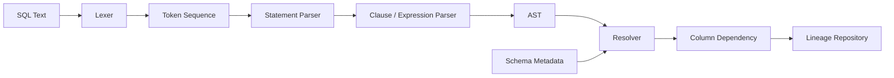
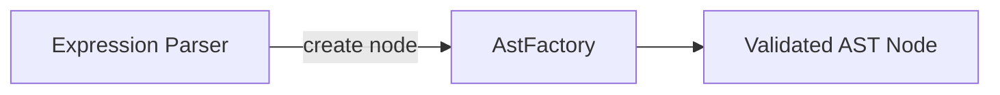
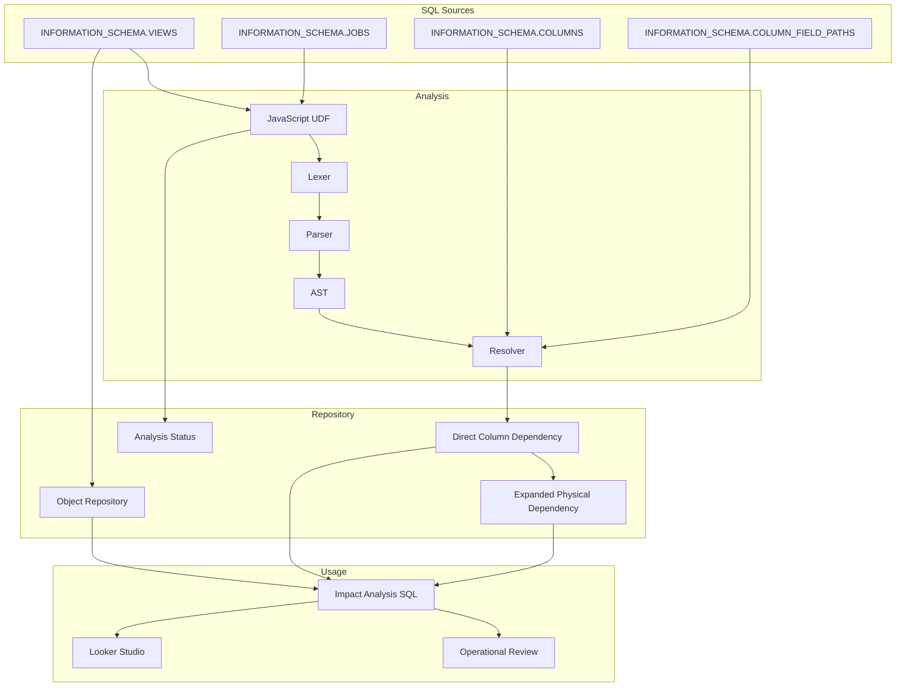

# BigQuery Physical Lineage Architecture Overview

> **Version:** 0.5 Draft  
> **目的:** BigQuery上のカラムレベル依存関係を高精度かつ効率的に把握し、変更時の影響分析を改善するための設計思想とアーキテクチャを説明する。

---

## 目次

1. システム概要
2. カラムレベル解析が必要となる理由
3. SQL解析アーキテクチャ
4. JavaScript UDFによる解析基盤
5. 実装方式の検討
6. 全体構成
7. 設計上の前提・対象範囲（Scope）
8. 今後の拡張性
9. 用語

---

# 1. システム概要

## 1.1 背景

BigQueryを利用したデータ基盤では、テーブル、View、Scheduled Query、DAGなどを通じて、多数のデータオブジェクトが相互に参照される。

物理テーブルのカラム変更や廃止を行う場合、運用担当者は次の点を確認する必要がある。

- 変更対象のカラムを参照しているViewはどれか
- そのViewのどの出力カラムへ影響するか
- 下流のViewや生成テーブルへ、どこまで影響が伝播するか
- CTEやサブクエリを経由した間接依存が存在しないか
- 削除済みViewや生成されなくなったテーブルがRepositoryへ残っていないか

テーブル単位の依存関係だけでは、これらを十分な精度で判断できない。

本システムは、**カラムレベルのPhysical Lineage Repository**を構築し、影響分析の精度と効率を改善する。

## 1.2 目的

本システムの目的はSQL Parserを作ることではない。

> **BigQuery上の物理テーブルまたはカラム変更時に、影響を受ける下流オブジェクトとカラムを、正確かつ効率的に特定できる状態を作る。**

この目的のために、以下を行う。

- View定義および実行済みSQLを収集する
- SQLを構文解析する
- 出力カラムと入力カラムの対応関係を解決する
- 中間ViewやCTEを経由した依存関係を物理カラムまで展開する
- Repositoryへ依存情報を登録する
- 影響範囲をRankまたは深さとして提示する

## 1.3 解決する運用課題

### 影響調査の精度不足

テーブル単位の依存情報では、対象カラムがどの出力カラムへ影響するかを判断できない。結果として、実際には影響しないオブジェクトまで調査候補へ含まれる。

### 影響調査の作業負荷

SQLを目視で追跡する方法では、SQL数と複雑性が増えるほど調査時間が増大する。CTE、サブクエリ、`SELECT *`、式、別名、ネスト構造がある場合は特に負荷が高い。

### Repositoryの鮮度維持

依存関係は一度構築すれば終わりではない。Viewの追加・変更・削除、Scheduled Queryの変更、DAG実行SQLの変更、生成されなくなったテーブルを継続的に反映する必要がある。

## 1.4 設計原則

1. **運用目的を優先する**  
   Parserの高度化ではなく、影響分析の精度と効率改善に必要な解析を優先する。

2. **必要な情報のみ解析する**  
   Repositoryへ保持するカラム依存関係に不要な制御情報は、原則として直接解析しない。

3. **実行結果に近い情報を利用する**  
   Viewは定義SQL、Scheduled QueryやDAGはJOBSへ記録された実行SQLを利用する。

4. **BigQuery中心で運用する**  
   常駐サーバや別アプリケーションを必須とせず、BigQuery SQLとJavaScript UDFを中心に構成する。

5. **責務を分離する**  
   Lexer、Parser、Resolver、Repository Builderを分離する。

6. **再実行可能性を持つ**  
   日次処理の再実行によって重複や不整合が発生しにくい構成とする。

## 設計判断

- 本システムの主役はParserではなく、運用時に利用可能なPhysical Lineage Repositoryである。
- SQL解析は、カラムレベル影響分析を実現するための手段として位置付ける。
- 設計判断は実装都合ではなく、運用目的から説明する。

---

# 2. カラムレベル解析が必要となる理由

## 2.1 テーブルレベル依存関係だけでは不足する理由

```sql
CREATE VIEW mart.order_summary AS
SELECT
  order_id,
  quantity * unit_price AS total_amount,
  customer_id
FROM raw.orders;
```

テーブルレベルでは、`mart.order_summary` が `raw.orders` を参照することまでしか分からない。

運用で必要となる情報は次である。

| 出力カラム | 入力カラム |
|---|---|
| `order_id` | `raw.orders.order_id` |
| `total_amount` | `raw.orders.quantity` |
| `total_amount` | `raw.orders.unit_price` |
| `customer_id` | `raw.orders.customer_id` |

`unit_price` の型変更時に、直接影響を受けるのは `total_amount` である。カラムレベル依存があれば、不要な確認範囲を減らせる。

## 2.2 単純な文字列検索では不足する理由

### 別名

```sql
SELECT customer_id AS member_id
FROM raw.orders;
```

### 式

```sql
SELECT quantity * unit_price AS total_amount
FROM raw.orders;
```

### 集約

```sql
SELECT
  customer_id,
  SUM(amount) AS total_amount
FROM raw.orders
GROUP BY customer_id;
```

### CASE式

```sql
SELECT
  CASE
    WHEN status = 'CANCELLED' THEN 0
    ELSE amount
  END AS effective_amount
FROM raw.orders;
```

文字列検索では、別名、複数入力、条件式、関数引数、同名カラムのスコープを正しく区別できない。

## 2.3 CTEとスコープ

```sql
WITH orders AS (
  SELECT
    order_id,
    quantity * unit_price AS total_amount
  FROM raw.orders
)
SELECT
  order_id,
  total_amount
FROM orders;
```

解析では、最終SELECTの `orders.total_amount` をCTE出力へ接続し、さらに `raw.orders.quantity` と `raw.orders.unit_price` まで展開する必要がある。

## 2.4 サブクエリ

```sql
SELECT
  c.customer_id,
  (
    SELECT MAX(o.order_date)
    FROM raw.orders AS o
    WHERE o.customer_id = c.customer_id
  ) AS latest_order_date
FROM raw.customers AS c;
```

必要となる処理は次のとおりである。

- サブクエリ境界の認識
- 内側・外側のスコープ管理
- テーブル別名の解決
- 相関参照の解決
- サブクエリ結果と出力カラムの対応

## 2.5 SELECT *

`SELECT *` はSQL文字列だけでは出力列を確定できない。`INFORMATION_SCHEMA.COLUMNS` 等を参照し、物理スキーマを展開する必要がある。

```sql
SELECT * EXCEPT(update_timestamp)
FROM raw.orders;
```

```sql
SELECT * REPLACE(
  SAFE_CAST(amount AS NUMERIC) AS amount
)
FROM raw.orders;
```

## 2.6 STRUCT、ARRAY、UNNEST

```sql
SELECT
  customer.id AS customer_id,
  item.product_id,
  item.quantity
FROM raw.orders,
UNNEST(items) AS item;
```

STRUCTフィールド、ARRAY要素、`UNNEST` による別名、ネストされたフィールドパスを解決する必要がある。

## 2.7 最終物理カラムまでの展開

```text
raw.orders.unit_price
  ↓ Rank 1
view_a.total_amount
  ↓ Rank 2
view_b.sales_amount
  ↓ Rank 3
mart.monthly_sales.total_sales
```

直接依存だけでなく、中間Viewを再帰的に展開した依存関係を保持することで、変更の伝播範囲を把握できる。

## 2.8 運用改善との関係

解析精度の向上は次の運用効果につながる。

- 不要な調査対象の削減
- 変更レビュー範囲の明確化
- 影響漏れの抑止
- 障害時の原因調査短縮
- 廃止予定カラムの利用状況把握
- 変更計画の説明根拠確保

## 設計判断

- 別名、式、CTE、サブクエリ、`SELECT *`、STRUCT、ARRAYを扱うため、文字列検索ではなく構文解析を採用する。
- Parserの出力とスキーマMetadataを組み合わせ、最終物理カラムまで解決する。

---

# 3. SQL解析アーキテクチャ

## 3.1 処理フロー



## 3.2 Lexer

LexerはSQL文字列をToken列へ変換する。

主なTokenはKeyword、Identifier、Number、String、Operator、Symbol、Comment、Backquoted Identifierである。

Tokenには、値だけでなくToken sequence、行番号、列番号、括弧深度を保持する。これにより、解析エラーや未対応構文の場所を特定しやすくする。

## 3.3 Token Reader

Token ReaderはParserがToken列を参照する共通インターフェースである。

主な責務は次のとおりである。

- 現在位置の参照
- 次Tokenへの移動
- 巻き戻し
- コメントを除外した参照
- 対応する閉じ括弧の検索
- Token範囲の切り出し
- Token列パターンの検索

## 3.4 Statement Parser

Statement ParserはSQL文の種別と主要構造を判定する。

- SELECT
- CREATE VIEW
- CREATE TABLE AS SELECT
- INSERT ... SELECT
- MERGE
- WITHを伴うStatement

最終的に依存関係を生成するSELECT部分を特定し、後続Parserへ渡す。

## 3.5 Clause Parser

SELECT文をSELECT、FROM、WHERE、GROUP BY、HAVING、QUALIFY、ORDER BYへ分解する。

句境界は括弧深度を考慮して判定し、サブクエリ内部のキーワードを外側SELECTの境界として扱わない。

## 3.6 Expression ParserとAstFactory

Expression Parserはカラム参照、リテラル、演算、関数呼び出し、CASE、CAST、STRUCT、ARRAY、スカラサブクエリ、Window関数を解析する。

ASTノード生成、NodeType定義、入力値検証はAstFactoryへ集約する。



## 3.7 Resolver

ResolverはParser結果とBigQuery Metadataを組み合わせて、参照元を具体化する。

- テーブル別名
- CTE参照
- サブクエリ出力
- 出力別名
- `SELECT *`
- STRUCTフィールド
- `UNNEST` 別名
- View依存の再帰展開
- 最終物理カラム

## 3.8 ParserとResolverを分離する理由

分離により次が可能になる。

- Parser単体のNode.js回帰試験
- スキーマ取得方式変更時の影響抑制
- 構文エラーと未解決参照の区別
- Repository登録前の解析結果検証
- 構文処理と環境依存処理の疎結合化

## 3.9 Repository Builder

Repository Builderは解析結果を運用可能な依存情報へ変換する。

- SQLソース情報との紐付け
- 出力・入力オブジェクトとカラムの確定
- 直接依存の登録
- 再帰展開
- Rank計算
- 有効・無効状態の管理
- 再実行時の置換

## 設計判断

- SQL解析をLexer、Parser、Resolver、Repository Builderへ分割する。
- AST生成責務はAstFactoryへ集約する。
- Parserは構文解析へ集中し、物理スキーマ解決はResolverで行う。
- Repository更新は解析処理と分離し、再実行可能性と鮮度管理を担保する。

---

# 4. JavaScript UDFによる解析基盤

## 4.1 BigQuery SQLだけでの実装が難しい理由

SQL Parserでは、文字単位の走査、現在位置の保持、Token列の前後移動、括弧深度管理、状態分岐、再帰的な式解析、AST生成が必要となる。

これらをBigQuery SQLだけで実装すると、処理意図が分かりにくくなり、保守性とテスト容易性が低下する。

## 4.2 JavaScript UDFを採用する理由

JavaScriptは次の要件に適している。

- 文字列走査
- 配列処理
- オブジェクトによるAST表現
- 再帰処理
- 状態管理
- クラス・関数による責務分離
- Node.js環境での事前試験

SQL収集とRepository更新はBigQuery SQL、構文解析はJavaScript UDFという分担とする。

## 4.3 GCS外部ライブラリ方式

ParserとResolverの実装が進むと、JavaScriptコードはBigQueryのインラインコードサイズ上限を超える。

この制約へ対応するため、`lineage_udf_bundle.js` をGCSへ配置し、外部ライブラリとして参照する。

```sql
CREATE OR REPLACE FUNCTION dataset.parse_lineage(sql_text STRING)
RETURNS JSON
LANGUAGE js
OPTIONS (
  library = ['gs://bucket/path/lineage_udf_bundle.js']
)
AS """
  return parseLineage(sql_text);
""";
```

GCS方式の主理由は、**インラインコードサイズ制限への対応**である。保守性とNode.jsテストは追加の利点である。

## 4.4 bundleサイズ

正式版では実測値を次の形式で記録する。

```text
Current bundle size:
XXX KB
Approximately X times the inline 32 KB limit
```

サイズを記録する目的は、インライン方式を採用できない根拠、肥大化傾向、外部ライブラリ上限への接近状況を確認することである。

## 4.5 コストと性能

外部ライブラリのファイルサイズ自体が、BigQueryの処理データ量へ直接加算されるわけではない。

性能に影響する主な要素は、UDF呼び出し回数、SQL長、構文複雑性、再帰量、Metadata参照量である。

本システムは1つのSQL文を1つの解析単位とする。

```text
1 SQL statement
  → 1 parser execution
  → multiple dependency records
```

## 4.6 Node.jsによる回帰試験

Parser本体はNode.jsでも実行可能な構成とし、Lexer、Token Reader、Parser、AST、Resolver前段の結果をBigQueryへのデプロイ前に確認する。

Node.jsは開発・回帰試験に利用し、本番実行基盤として必須にはしない。

## 4.7 設定管理

環境依存値は設定テーブルで管理する。

- `repository_project_id`
- `udf_dataset`
- `udf_function_name`
- `parser_strict_mode`
- Scheduled Queryサービスアカウント
- DAGサービスアカウント
- GCS library path

## 設計判断

- 構文解析にはJavaScript UDFを採用する。
- bundleがインライン上限を超えるため、GCS外部ライブラリ方式を採用する。
- Node.jsは回帰試験に利用するが、本番運用の必須基盤にはしない。
- 環境依存値は設定テーブルへ分離する。

---

# 5. 実装方式の検討

## 5.1 評価観点

実装方式は一般的な優劣ではなく、今回の目的であるカラムレベル依存解析への適用性で評価する。

- BigQuery構文への対応
- カラム依存関係の取得
- CTE、サブクエリ、別名の解決
- `SELECT *` の展開
- 最終物理カラムへの解決
- BigQuery内での運用
- 保守性
- 回帰試験可能性

## 5.2 比較結果

| 方式 | 適用性 | 採用 | 理由 |
|---|---:|:---:|---|
| INFORMATION_SCHEMAのみ | 低い | × | Metadata取得には有効だが、SELECT式内のカラム対応を取得できない |
| 文字列検索 | 低い | × | 別名、スコープ、式構造を区別できない |
| 正規表現 | 限定的 | × | 再帰構造、CTE、サブクエリ、括弧スコープを安定して処理しにくい |
| BigQuery SQLのみ | 限定的 | × | 状態管理、Token走査、再帰解析の保守性が低い |
| 既存SQL Parser | 条件付き | × | BigQuery固有構文、UDF統合、必要な出力形式への適合コストがある |
| 独自JavaScript Parser + Resolver | 高い | ○ | 必要な構文とRepository要件に合わせて段階的に実装・検証できる |

## 5.3 INFORMATION_SCHEMAのみ

`INFORMATION_SCHEMA` はView定義、カラム定義、STRUCTフィールド、JOBS履歴の取得に利用する。

一方、出力式、複数入力カラム、CTE出力、別名、CASE式、関数引数の依存までは取得できない。

Parserの代替ではなく、ParserとResolverを支えるMetadata源として利用する。

## 5.4 正規表現

正規表現は固定形式の抽出には有効だが、SQLの再帰構造とスコープを扱う用途には適さない。

同じ `SELECT`、`FROM`、`AS` が、外側Statement、CTE、サブクエリ、関数内で異なる意味を持つためである。

## 5.5 BigQuery SQLのみ

SQLのみでToken表や再帰CTEを用いて解析することは可能だが、逐次位置管理、括弧深度、読み戻し、再帰式解析の意図が分かりにくくなる。

Repository構築とMetadata処理はSQL、ParserはJavaScriptという分担を採用する。

## 5.6 既存SQL Parser

既存Parserは一般的に有力だが、本システムでは次を満たす必要がある。

- BigQuery固有構文
- `QUALIFY`、`UNNEST`、STRUCT、ARRAY
- JavaScript UDF上での実行
- 必要なカラム依存形式
- bundleサイズ制約
- 外部依存管理
- 段階的な独自拡張

今回の実行環境・構文・出力要件への適合コストを考慮し、独自Parserを採用する。

## 5.7 独自JavaScript Parser + Resolver

独自実装には開発コストがある一方、対象構文を限定し、Repositoryに必要な情報だけを出力できる。

未対応構文は回帰試験とともに段階追加し、汎用SQL Parser製品を目指さない。

## 5.8 採用構成

```text
INFORMATION_SCHEMA / JOBS
        +
BigQuery SQL pipeline
        +
Custom JavaScript Parser
        +
Resolver
        +
Lineage Repository
```

## 設計判断

- INFORMATION_SCHEMAはMetadata源として利用する。
- 正規表現やSQLのみでParserを構築する方式は採用しない。
- 対象構文と出力要件を限定した独自JavaScript Parserを採用する。
- 独自実装の範囲は、運用改善に必要な構文へ限定する。

---

# 6. 全体構成

## 6.1 論理構成



## 6.2 SQLソース

### View

`INFORMATION_SCHEMA.VIEWS` の定義SQLを解析する。

### Scheduled Query

JOBSへ記録された実行SQLを解析する。識別には原則として `labels.data_source_id = 'scheduled_query'` を利用する。

### DAG

ラベルが欠落する環境を考慮し、設定テーブルのサービスアカウント `user_email` を補助条件に利用する。

### CTAS・DML

JOBSの実行SQLからSELECT部分を特定し、生成先と参照元カラムの依存関係を構築する。

## 6.3 JOBS収集期間

- 初回: 直近60日
- 通常更新: 直近3日
- 同一対象の依存登録: DELETE + INSERT
- 同一出力への複数実行: 後勝ち
- 一時失敗: 翌日再実行で回復
- 60日を超える周期: 現時点では対象外

## 6.4 Repository更新

1. SQLを収集する
2. 解析対象を特定する
3. Parserを実行する
4. 解析結果を検証する
5. 対象オブジェクトの既存依存を削除する
6. 最新依存を登録する
7. 生成されなくなったオブジェクトを非アクティブ化する
8. 削除済みView状態を反映する
9. 再帰展開を更新する

## 6.5 影響分析UI

テーブル、View、カラムを入力し、影響先をRank順に表示する。

- Rank 1: 直接依存
- Rank 2: 中間オブジェクトを1つ経由
- Rank 3以降: さらに下流の間接依存

Looker StudioはRepositoryの利用手段であり、中心はRepositoryの精度と鮮度である。

## 6.6 運用品質管理

記録対象の例は次のとおりである。

- 解析成功・失敗
- 未対応構文
- Resolver未解決参照
- Repository登録件数
- 対象SQL件数
- 非アクティブ化件数
- 最終更新日時
- bundle version
- parser version

## 設計判断

- View定義とJOBS実行SQLを主要解析ソースとする。
- JOBSは期間限定で取り込む。
- 依存更新はDELETE + INSERTを基本とする。
- UIよりRepositoryの精度と鮮度を優先する。
- 解析失敗や未解決参照を状態として可視化する。

---

# 7. 設計上の前提・対象範囲（Scope）

## 7.1 Scopeの考え方

対象外は、技術的に解析できないことを意味しない。

目的に必要な情報がView定義または実行済みSQLから取得できる場合、SQLを生成する上位制御構文そのものを解析する必要はない。

## 7.2 対象

| 対象 | 解析ソース | 理由 |
|---|---|---|
| View | `INFORMATION_SCHEMA.VIEWS` | 出力カラムと参照元カラムの関係が定義SQLに保持される |
| SELECT | View定義・JOBS | カラム依存関係の基本単位 |
| CTE | View定義・JOBS | 中間結果と最終出力の解決に必要 |
| サブクエリ | View定義・JOBS | 出力式や条件式の依存解決に必要 |
| Scheduled Query | JOBS | 実行SQLから生成テーブルとの依存を取得できる |
| DAG実行SQL | JOBS | 実行済みSQLから依存を取得できる |
| CTAS | JOBS | 生成テーブルと入力カラムの関係を保持できる |
| INSERT ... SELECT | JOBS | 挿入先と入力カラムの関係を保持できる |
| MERGE | JOBS | 更新・挿入対象と入力カラムの関係を保持する |
| `SELECT *` | SQL + Metadata | 物理スキーマを用いた展開が必要 |
| STRUCT / ARRAY / UNNEST | SQL + Metadata | BigQueryのネスト構造を扱うため |

## 7.3 直接解析の対象外

| 対象外 | 理由 |
|---|---|
| ストアドプロシージャ定義全体 | 必要なのは制御構造ではなく内部で実行されたSQLであり、JOBSから取得できる |
| `EXECUTE IMMEDIATE` のSQL生成処理 | 生成ロジックではなく、最終的に実行されたSQLをJOBSから取得する |
| `DECLARE` | 変数宣言自体は物理カラム依存を生成しない |
| `SET` | 制御用変数への代入は物理カラム依存の主対象ではない |
| `IF` | 分岐そのものではなく、分岐先で実行されたSQLを解析する |
| `LOOP` / `WHILE` | 反復制御ではなく、実行されたSQLを解析する |
| `BEGIN ... END` | Statementグループではなく、個々の実行SQLを対象とする |
| `CALL` | 呼び出し先で実行されたSQLを対象とする |
| 外部システムのSQL生成ロジック | BigQuery実行前の処理ではなく、BigQueryで実行されたSQLを解析する |
| 実行されなかった動的SQL候補 | 実際のPhysical Lineageを形成していない |

## 7.4 対象外の意味

```sql
DECLARE target_date DATE DEFAULT CURRENT_DATE();

IF EXTRACT(DAYOFWEEK FROM target_date) = 2 THEN
  EXECUTE IMMEDIATE """
    CREATE OR REPLACE TABLE mart.weekly_sales AS
    SELECT
      customer_id,
      SUM(amount) AS total_amount
    FROM raw.orders
    GROUP BY customer_id
  """;
END IF;
```

必要な依存関係は次である。

```text
mart.weekly_sales.customer_id
  → raw.orders.customer_id

mart.weekly_sales.total_amount
  → raw.orders.amount
```

`DECLARE`、`IF`、`EXECUTE IMMEDIATE` の生成処理を詳細解析しなくても、実際に実行されたCTAS SQLをJOBSから取得できれば、必要な依存関係を構築できる。

したがって、これらは未対応だからではなく、**本来の目的に対して直接解析が不要であるため対象外**とする。

## 7.5 実行SQLを利用する利点

- 実際に物理オブジェクトへ反映されたSQLだけを対象にできる
- 動的SQLの最終形を取得できる
- 実行されなかった分岐をRepositoryへ登録しない
- DAGやアプリケーションのSQL生成方式へ依存しにくい
- Stored Procedure内部の実行SQLも同じパイプラインへ統合できる

## 7.6 Scope上の制約

- JOBS保持期間内に対象SQLを収集する
- Scheduled QueryやDAGを識別するラベル・サービスアカウントを設定する
- 実行履歴に残らない外部処理は解析できない
- BigQuery実行前のSQL候補は対象としない
- 対応構文は運用で必要となるSQLから段階的に追加する
- 未対応SQLは解析失敗状態として記録する

## Scopeの要約

> 本システムは、BigQuery上で実際に実行されたSQL、およびView定義として保持されるSQLを解析対象とする。Repositoryの目的はカラムレベル依存関係の構築であり、制御構文やSQL生成処理そのものではなく、最終的に実行されるSQLから依存関係を取得することを設計上の前提とする。

## 設計判断

- Viewは定義SQLを解析する。
- Scheduled Query、DAG、Stored Procedure内部処理、動的SQLはJOBSの実行SQLを解析する。
- 制御構文は、カラム依存情報の取得に直接不要なため対象外とする。
- 実行されなかったSQL候補はRepositoryへ保持しない。

---

# 8. 今後の拡張性

本システムは、現在の運用における影響分析の精度と効率改善を最優先とする。

将来拡張を目的として過剰な汎用Parserを構築しない。

一方、Lexer、Parser、AST、Resolver、Repository Builderを分離しているため、運用上必要となったBigQuery構文は、回帰試験を追加しながら段階的に対応できる。

拡張性は主目的ではなく、現在の運用品質を維持しながら必要な変更を安全に追加するための設計特性として扱う。

---

# 9. 用語

| 用語 | 説明 |
|---|---|
| Physical Lineage | 物理テーブル・View・カラム間の実体ベースの依存関係 |
| Repository | 依存関係、オブジェクト状態、解析状態を保持するBigQueryテーブル群 |
| Lexer | SQL文字列をToken列へ変換する処理 |
| Token | Keyword、Identifier、Symbol等へ分割されたSQLの解析単位 |
| Parser | Token列をSQL構造として解釈する処理 |
| AST | SQL式やStatement構造を表す抽象構文木 |
| Resolver | AST上の参照をCTE、別名、Metadataから具体的な参照元へ解決する処理 |
| Direct Dependency | SQL内で直接参照されるカラム間の依存関係 |
| Expanded Dependency | 中間Viewを再帰展開した最終物理カラムとの依存関係 |
| Rank | 変更元から影響先までの依存段数 |
| CTAS | `CREATE TABLE AS SELECT` |
| GCS Library | BigQuery JavaScript UDFから参照するCloud Storage上の外部JavaScriptファイル |

---

# Ver.0.5 レビュー観点

- ドキュメントの重心が運用改善に置かれているか
- Parserの技術説明が目的化していないか
- Scopeの対象・対象外と理由が妥当か
- 実装方式の比較が客観的か
- 章の順序に飛躍がないか
- Repositoryの役割が十分に伝わるか
- 今後の拡張性が過度に強調されていないか

# Ver.0.9で反映予定

- `lineage_udf_bundle.js` の実測サイズ
- BigQuery公式仕様への参照
- 実Repositoryテーブル名との整合
- Parser出力例
- Looker Studio画面項目との整合
- 回帰試験件数・対応構文一覧
- 設定テーブル項目の正式名称
- 図表の最終調整
