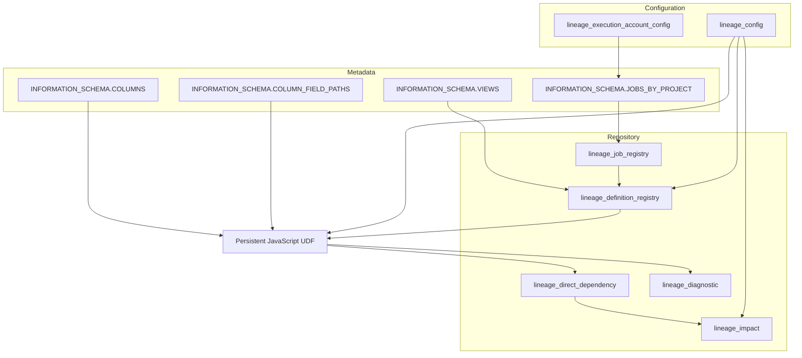
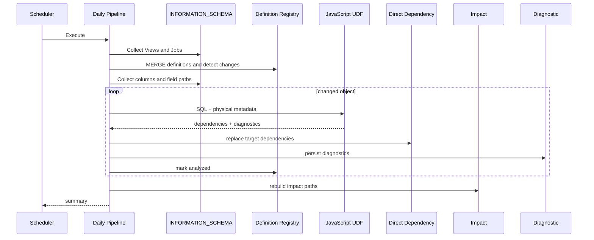

# Architecture

## 1. 全体像

本システムは、定義収集、変更検知、SQL解析、直接依存関係の保存、Impact展開、診断・検証の六つの領域で構成します。

## 2. コンポーネント責務

### Configuration

環境、対象Dataset、UDF、Impact上限などを管理します。実行アカウントは変更頻度と多値性が異なるため、`lineage_execution_account_config`へ分離します。

### Definition Registry

解析対象のSQL定義と状態を管理します。定義ハッシュにより変更を検出し、`is_changed`と`analysis_status`で解析対象と結果を表します。

### Job Registry

Scheduled QueryとDAGのジョブメタデータを保持します。Scheduled Queryはラベルと登録アカウントの組み合わせで判定し、DAGは登録アカウントで判定します。

### JavaScript UDF

SQLをトークン化・解析し、依存関係と診断結果をJSONで返します。BigQuery SQL側はメタデータ収集、状態管理、永続化を担当します。

### Direct Dependency

一つのsource columnから一つのtarget columnへの直接エッジを保持します。多段展開前の正規化された事実テーブルです。

### Impact

Direct Dependencyを再帰的に連結し、物理カラムを起点とする下流影響経路を保持します。

## 3. 日次シーケンス

## 4. 障害境界

解析結果は一時領域で完成させてから既存Dependencyを置換します。置換に失敗した場合はバックアップから復元し、RegistryをFAILEDとして次回再解析対象に残します。

## 5. 拡張ポイント

- SQL構文対応の追加
- Job source種別の追加
- 複数region・複数projectの収集
- Impact snapshotの保持方針
- Looker Studio監視画面
- CIによるParser回帰試験
