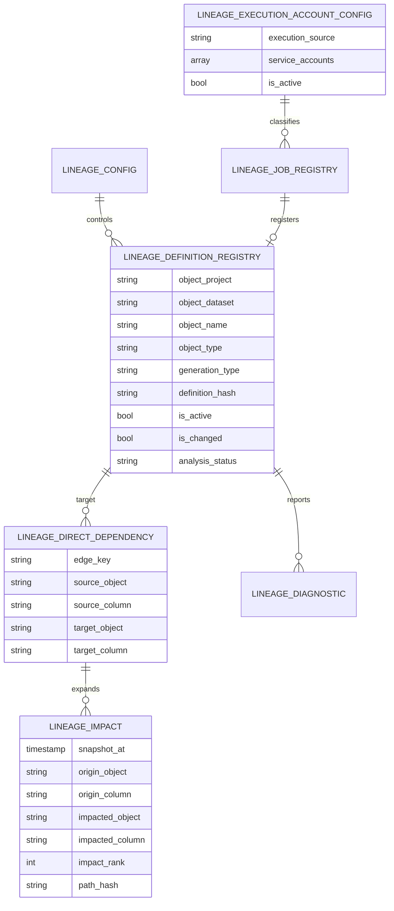

# Repository ER

```mermaid
erDiagram
  LINEAGE_CONFIG ||--o{ LINEAGE_DEFINITION_REGISTRY : controls
  LINEAGE_EXECUTION_ACCOUNT_CONFIG ||--o{ LINEAGE_JOB_REGISTRY : classifies
  LINEAGE_JOB_REGISTRY ||--o| LINEAGE_DEFINITION_REGISTRY : registers
  LINEAGE_DEFINITION_REGISTRY ||--o{ LINEAGE_DIRECT_DEPENDENCY : target
  LINEAGE_DEFINITION_REGISTRY ||--o{ LINEAGE_DIAGNOSTIC : reports
  LINEAGE_DIRECT_DEPENDENCY ||--o{ LINEAGE_IMPACT : expands

  LINEAGE_EXECUTION_ACCOUNT_CONFIG {
    string execution_source
    array service_accounts
    bool is_active
  }

  LINEAGE_DEFINITION_REGISTRY {
    string object_project
    string object_dataset
    string object_name
    string object_type
    string generation_type
    string definition_hash
    bool is_active
    bool is_changed
    string analysis_status
  }

  LINEAGE_DIRECT_DEPENDENCY {
    string edge_key
    string source_object
    string source_column
    string target_object
    string target_column
  }

  LINEAGE_IMPACT {
    timestamp snapshot_at
    string origin_object
    string origin_column
    string impacted_object
    string impacted_column
    int impact_rank
    string path_hash
  }
```

注: BigQueryでは主キー・外部キー制約を必ずしも強制していないため、本図は論理関係を表します。
