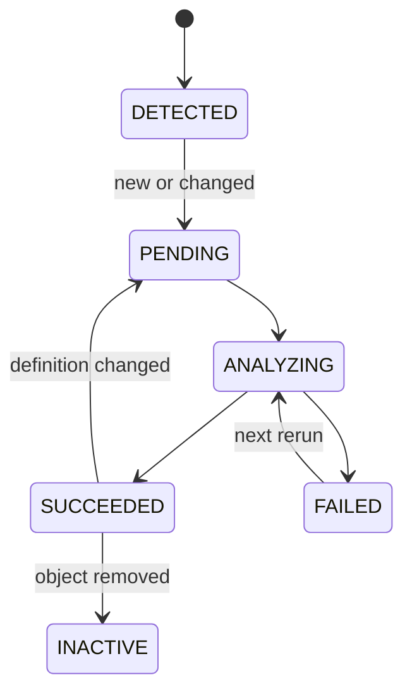

# System Design

## 1. Repositoryテーブル

### lineage_config

Repository全体の単一構成を管理します。

主な設定:

- Repository project・dataset
- 対象project・dataset
- UDF project・dataset・routine
- UDFライブラリURI
- region
- 最大Impact階層
- strict mode

### lineage_execution_account_config

ジョブ起源ごとの実行サービスアカウントを管理します。

| 項目 | 意味 |
|---|---|
| execution_source | `SCHEDULED_QUERY`または`DAG` |
| service_accounts | 許可されたメールアドレスの`ARRAY<STRING>` |
| is_active | 使用可否 |
| description | 運用説明 |
| created_at / updated_at | 監査日時 |

同じアカウントが両区分に存在し、Scheduled Queryラベルがある場合は`SCHEDULED_QUERY`を優先します。

### lineage_definition_registry

Viewおよびジョブ生成テーブルの解析対象定義を管理します。

重要な状態:

- `definition_hash`
- `previous_definition_hash`
- `is_active`
- `is_changed`
- `analysis_status`
- `generation_type`

### lineage_direct_dependency

列単位の直接エッジを保持します。`edge_key`は論理的な一意キーとして使用します。

### lineage_impact

Direct Dependencyを多段展開した経路を保持します。`impact_rank`は起点からの段数、`path_hash`は経路の識別に使用します。

### lineage_diagnostic

解析時のERROR、WARNING、情報を保持します。障害調査の第一参照先です。

### lineage_job_registry

収集したジョブのSQL、出力先、実行ユーザー、起源判定方式を保持します。

## 2. 状態遷移

## 3. 一意性

- Definition: project + dataset + object + type + generation type
- Direct Dependency: `edge_key`
- Job: job project + job ID
- Impact: snapshot + origin + `path_hash`

## 4. 更新方式

- 設定: `MERGE`
- Registry: メタデータとの`MERGE`
- Direct Dependency: オブジェクト単位の安全な置換
- Impact: Direct Dependencyから再構築
- Diagnostic: 解析単位で追加・整理
- Job Registry: project + job IDで`MERGE`

## 5. データ保持

現行SQLの保持動作を正とします。長期運用前に、Diagnostic、Job Registry、Impact snapshotの保持期間と削除処理を運用ポリシーとして確定してください。

## 6. セキュリティ

必要権限は最小化し、Repository書込、対象Datasetメタデータ参照、JOBSメタデータ参照、GCSライブラリ参照を分離して付与します。サービスアカウント配列はジョブの起源判定に使用する設定であり、認証情報そのものではありません。
