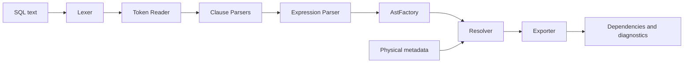

# JavaScript UDF Design

## 1. 役割

Persistent JavaScript UDFは、SQL文字列と物理カラムメタデータを受け取り、列依存関係と診断情報をJSONとして返します。

SQL側はRepository制御を担当し、JavaScript側は構文解析と解決に集中します。

## 2. 論理構成

## 3. コンポーネント

### Lexer

SQLを識別子、予約語、リテラル、演算子、記号、コメントなどのTokenへ分解します。行・列および括弧深度を保持します。

### Token Reader

Token位置の前進、巻戻し、先読み、対応括弧検索、Token sequenceのsliceを提供します。外部公開位置はtoken sequence基準とします。

### Clause Parser

SELECT、FROM、WHERE、GROUP BY、QUALIFYなど、句ごとの構造を解析します。

コメント除去は現時点ではSelectParser内の`removeCommentTokens()`に保持し、複数Parserで同様の処理が必要になった時点で共通化を再検討します。

### Expression Parser

式の構文解析に専念し、AST nodeの直接生成は行いません。

### AstFactory

NodeType定義、AST node生成、必須値検証を集約します。ExpressionParserはAstFactoryを呼び出します。プロジェクト全体はJavaScriptを継続します。

### Resolver

Alias、CTE、View出力、物理テーブル、STRUCT field path、UNNESTを解決し、最終物理カラムへ展開します。

### Exporter

Repositoryへ格納可能なdependencyとdiagnosticのJSONを生成します。

## 4. 設計原則

- ParserとAST生成を分離
- Tokenの位置情報を失わない
- 未解決要素を黙って破棄せずDiagnosticへ出す
- 解析結果の順序に依存しないedge key
- BigQuery JavaScript UDF制約内で動作
- メソッドチェーンを必要以上に使用しない
- コメントを多めにし、構文処理の意図を残す

## 5. 配置

GCSへJavaScript bundleを配置し、Persistent UDFの`OPTIONS (library=[...])`から参照します。本パッケージの`javascript/`はソースおよびbundle配置用の領域です。

## 6. 未収録物

現在のLTSパッケージ第1版には、実際のJavaScript bundle本体を同梱していません。公開・配布時は、使用中の確定版bundleと対応するソース、テストを追加してください。
